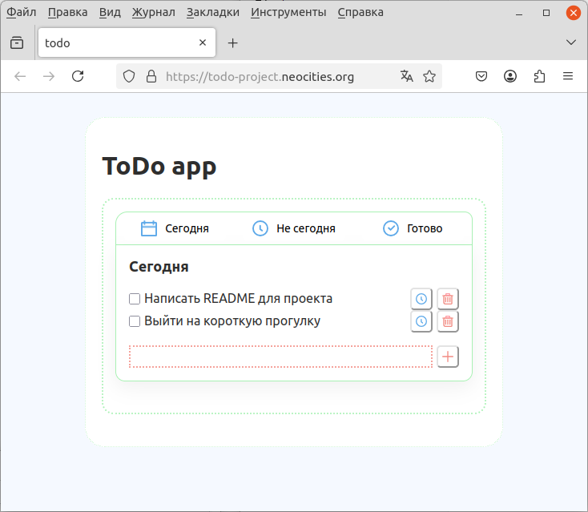
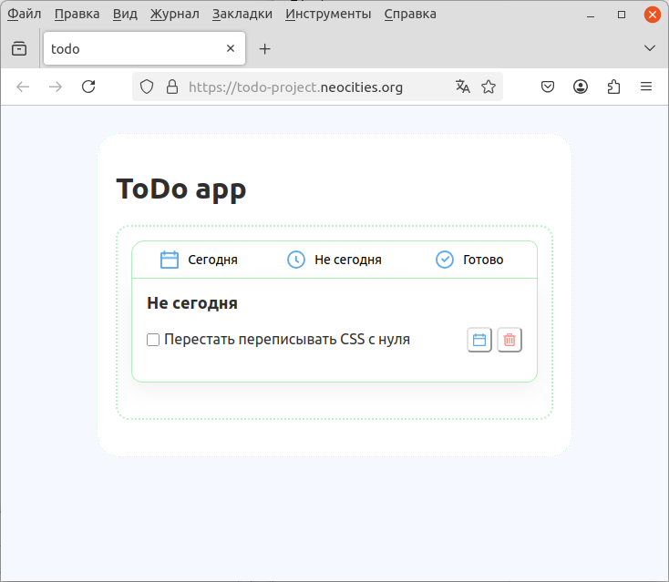
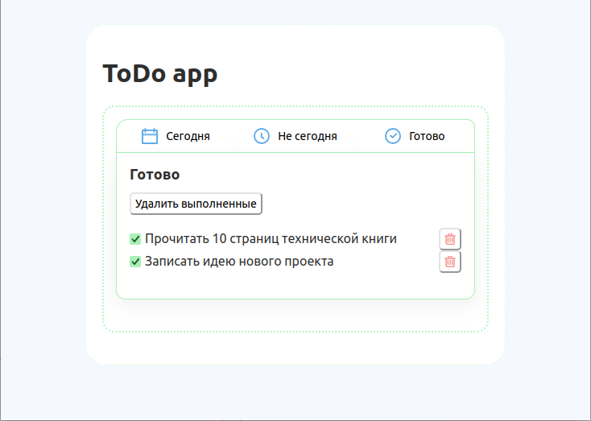

# Todo Project

Простое веб-приложение для управления задачами.  
Позволяет добавлять задачи, редактировать их, отмечать выполненными и перемещать между списками.

Проект написан в рамках практики фронтенд-разработки с использованием React и современного стека инструментов.

---

## Демо

🔗 Открыть приложение: https://todo-project.neocities.org/

---

## Возможности

- добавление новой задачи
- редактирование текста задачи
- удаление задачи
- отметка задачи как выполненной
- перемещение задач между списками
- разделение задач по статусам:
  - Сегодня
  - Не сегодня
  - Готово
- очистка списка выполненных задач
- сохранение задач в `localStorage` (данные не пропадают после перезагрузки страницы)
- простые UI-анимации и иконки

---

## Стек технологий

- **React**
- **JavaScript (ES6+)**
- **Vite**
- **CSS**
- **localStorage API**

---

## Структура проекта
src/
components/ # React-компоненты
Button/
Icon/
TaskItem/
TaskInput/
TaskView/
ViewSwitcher/

constants/ # конфигурации и константы
icons.js
taskStatus.js
viewConfig.js

layouts/ # layout-компоненты
Header/
Main/
MainLayout/

styles/ # общие стили и переменные

---

## Возможные улучшения

- drag & drop для задач
- фильтрация задач
- тёмная тема
- адаптивная версия для мобильных устройств
- сохранение задач на сервере
